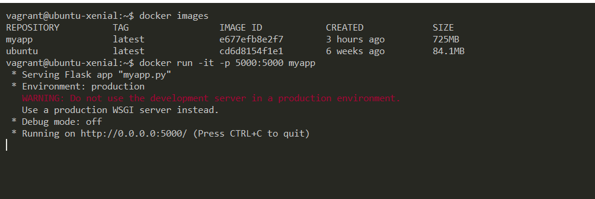

# ScaaS
Scientific Computing as a service

### execute below commands to check the app.

1. Create a Docker image first
````bash
git clone https://github.com/priyaldjango/ScaaS.git
cd ScaaS
docker build . -t myapp:latest 
````
verify your output using this command. 


2. run below command to start the app.
```bash
docker run -it -p 5000:5000 myapp
```
verify your output using this command. 


Now Goto browser and check the application home page.
Enter url: http://your_vm_ip:5000 or http://localhost:5000

There should be a page like shown below.


Follow the instruction below to generate the graph.  
Step 1: Please upload only .txt or .nc file or else if will not proceed further.  
  
Step 2: please click on "load variable" button  
  
Optional step: Press "show variable" button in the page to see variable list  
  
Step 3: Write a name of the variable in the text box and click on Draw Graph  
  
If your variable is 3D then it will ask for the level. Please provide intiger value there.  


